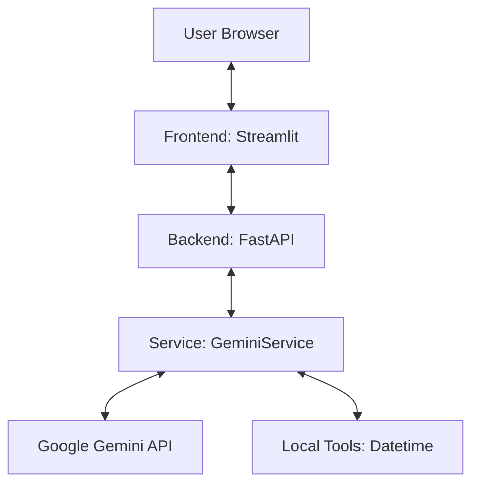

# Architecture Document: Gemini Chat Web Application

This document outlines the architecture for transitioning the CLI-based `gemini_chat_tool.py` into a full-stack web application using **FastAPI** (Backend) and **Streamlit** (Frontend).

## 1. Design Philosophy

- **DRY (Don't Repeat Yourself)**: Core Gemini logic is decoupled into a shared service layer, allowing it to be reused by different interfaces (CLI, API, Web).
- **KISS (Keep It Simple Stupid)**: The system avoids over-engineering, focusing on a clean separation of concerns and minimal boilerplate.

## 2. System Architecture

The following diagram illustrates the high-level architecture:



## 3. Project Structure

```text
/project_root
├── backend/
│   └── api.py              # FastAPI app & routes (New)
├── frontend/
│   └── app.py              # Streamlit UI & chat state (New)
├── src/
│   ├── services/
│   │   └── gemini_service.py # CORE logic (Moved from gemini_chat_tool.py)
│   ├── core/               # Existing shared utilities
│   └── bots/               # Existing bot implementations
├── .env                    # API Keys (GOOGLE_API_KEY)
└── requirements.txt        # Shared dependencies
```

## 4. Components

### 4.1. Core Service: `GeminiService`
- **Responsibility**: Wraps the `google-genai` SDK (modern version).
- **Features**:
    - Manages the Gemini API client.
    - Registers local tools (e.g., `get_current_datetime`).
    - Handles the function-calling workflow (sending prompts, executing tools locally, sending results back) manually to ensure control.
    - Returns deterministic, clean responses to the caller (API or CLI).

### 4.2. Backend: FastAPI
- **Responsibility**: Provides a RESTful API layer.
- **Endpoint**: `POST /chat`
    - **Request**: `{ "prompt": "User query here..." }`
    - **Response**: `{ "response": "Gemini's answer...", "status": "success" }`
- **Integration**: Initializes `GeminiService` and delegates chat logic.

### 4.3. Frontend: Streamlit
- **Responsibility**: Provides a modern, interactive user interface.
- **Features**:
    - **Chat Interface**: Maintains conversation history in `st.session_state`.
    - **API Interaction**: Uses the `requests` library to communicate with the FastAPI backend.
    - **Visuals**: Displays "thinking" states and formatted Gemini responses.

## 5. Data Flow (Chat Routine)

1.  **User** enters a prompt in the **Streamlit** UI.
2.  **Streamlit** sends a POST request to the **FastAPI** `/chat` endpoint.
3.  **FastAPI** calls the **GeminiService**.
4.  **GeminiService** interacts with the **Google Gemini API**.
5.  If a tool call (e.g., `get_current_datetime`) is requested by Gemini, **GeminiService** executes it locally and resolves the multi-turn interaction.
6.  **GeminiService** returns the final text response to **FastAPI**.
7.  **FastAPI** sends the JSON response back to **Streamlit**.
8.  **Streamlit** updates the chat history and renders the answer.

## 6. Development & Deployment

- **Environment**: Python 3.10+
- **Security**: API keys are managed via `.env` (not committed to source control).
- **Extensibility**: New tools can be added to `GeminiService` without modifying the backend or frontend code.
