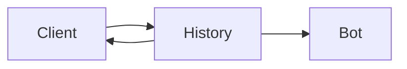

# App Understanding — High-level Overview

This file contains a very-high-level Mermaid diagram that explains how the local file-backed CLI chat prototype works and how components interact.

Key steps (very short):

- Clients append JSON messages to `history.jsonl` when the user sends a message.
- Clients and bots tail `history.jsonl` (read new lines) and display messages.
- `message_handler.py` provides message creation, parsing, and validation utilities.
- Bots (e.g., `echo_bot`) subscribe to new messages and may append automated replies.
- `tests/` validate message handling; `README.md` documents usage and next steps for AI integration.
